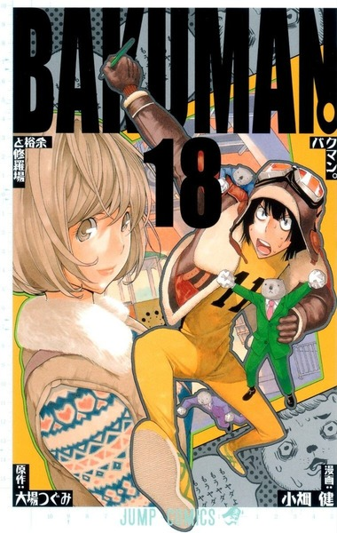
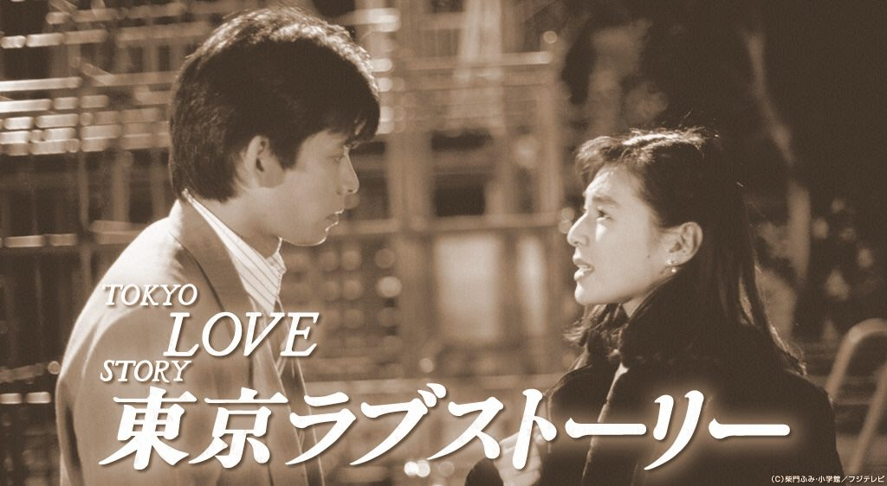

好久不见，又或是意外来得早的一次更新。

没想到翻翻时间差不多更好是一个月过去。如果能坚持每个月为自己写些东西也未尝不是一件好事。

想来想去在乏善可陈的生活里，值得写的也只有关于书影音的一些记录了。但如果要以博客的形式将之与私人记录区分开，大概文字里还是要多些雕琢的成分吧。

为什么要给自己增加无谓的麻烦呢（

## Bakuman与少年漫画

近期主要在看漫画。虽然说是近期，不过补漫画其实是去年开始的事。ios上Aidoku的阅读体验实在是太好了，虽然贵是贵了点，但在有空集中阅读的时候还是相当值得的。

意外的是最近都在看少年漫画。去年陆续补了猎人，又补了Bakuman，连现在在读的黑神都是Jump的副刊上连载的，要说也算是一种热血少年漫了。上一次看少年漫画的记忆还要追溯到中考前看通灵王，又或者是高考前补完了推理之绊。很奇妙地，阅读少年漫画的时间总是需要打一些鸡血的节点。虽然不认为自己身上还有什么能燃烧起来的地方，但那些无法以理性来衡量的，一途（いちず）地为了目标不惜头破血流的，只能称之为少年意气的东西，还是能给人一些鼓舞。

先从Bakuman说起吧。

Bakuman大概可以和《重版出来》联系起来看。但相比《重版出来》这种显而易见的鸡汤故事，Bakuman的内容反而更加理想化。

毕竟就算是《重版出来》里也有不少心碎追梦人啊。

Bakuman里的话……对角色的使用就堪称挥霍了。不少配角身上都有值得进一步讲述的故事，却浅浅地一笔带过。反派的重复利用是难以称道的偷懒，肥宅漫画家到最后都没能翻身更是堪称搞笑。

故事，当然还是好看的。一个细细讲述漫画创作过程的故事本来就足够精彩。后半程注水严重了点，有种jump特色的想要早点完结却迫于人气不得不继续画的美。

明明是一个为漫画赌上人生，一不小心就会变成满盘皆输的黑暗故事，却丝毫不让人感觉到灰暗。以主角为代表呈现的就是这样一个努力就会有回报，成功会恰如其分地展现才能的分量的故事。即使追梦的过程中会有瓶颈与挫折，两位主角依然能够远超常人的才能与努力攻克所有看似不可能的难关。

那个在读蔓玫的时候就怀有的疑问又浮现出来。

——努力的条件。

她说她只能写下去，这是她与疾病奋斗自我拯救的唯一方法。

那么，如果写不了呢？

在努力被轻描淡写为最低门槛的付出之时，没有人意识到努力的条件是苛刻的。

努力这件事最困难的地方就在于不去放弃。

换句话说，之所以能够努力，只是因为心存希望。尤其是，对自己身上存有的也许能称之为才能的东西怀有希望。不放弃是因为希望尚存，而漫画里的主角即使受挫，依旧享有预定胜利的未来。

所以努力是一种才能，但也是因为有才能而努力。

也许热血的本质就是对才能的信仰。

相比少年漫画里大多天赋异禀的主角，庸碌无为的人能从他们的故事中获得的养分，大概也就在于不放弃这点。但需常人终究无法用卓越的才能来颠覆眼前的挫折，谱写逆转的凯歌。 所以鸡血只是转瞬即逝，常人终究碌碌无为。

少年漫画，也只是在一瞬间向他们展示了希望罢了。

如星火一般微弱的火苗，一个短暂的成为主角的梦。

回到开篇的问题。少年漫画为谁而做？

答案是希望尚存的人。

我实在不认为才能是每个人都拥有的东西，当然与己更是无缘。这样的人大概永远无法成为少年漫画的忠实读者，尽管这只是悲观主义者的偏见。

但即使少年漫画面临着青黄不接（这可能也是读者的傲慢）的当下与未来依旧人气不减，依旧说明着人们依然需要少年漫画。就像那句话所说。

——宇宙奥秘，就是自信。

## 莉香与东京爱情故事

> 你该看看东京爱情故事，向赤名莉香学习一下如何当一个好女人。

十多年前，得知我徒劳无功也一筹莫展的单恋后，某位值得尊敬的——说朋友未免显的太过亲密——前辈如此说道。那时就有了看这部片的想法，却直到现在才看。也许正是现在的我，才能否定他这样的观点。

故事本身是好的，但赤名莉香却没有那么好。

始终认为赤名莉香的魅力更多的来自于选角而非人物本身的魅力。铃木保奈㺯的笑容实在是太有感染力，即使她有做错的地方，也没有人能不在她笑容面前释怀。

即使包括赤名莉香在内，故事本身依旧是个老套的爱情故事。正如多数人批判的，故事推进全靠偶然撞入一个白学经典时刻。加上他爱她她爱他式的多角恋爱关系，实在是白学和圈乱故事的圣经。男女主角感情发展缺乏铺垫，也让赤名莉香为什么会喜欢永尾完治成为影视剧史上的一大谜团。

世人都说莉香好，但如果换去演员，她也许不会那么好。

赤名莉香为了自己的爱情勇往直前倾尽所有的姿态显得眩目。但她同样有自己的任性偏执，甚至不少行为在今天都可以用作来形容。她会在主角面前生气和别扭，却几乎不会在主角面前袒露自己的软弱。在主角面前，她展露的永远是足以包容一切的太阳般明媚的笑容，和永远寡妇脸的里美更是对照鲜明。

人们痛骂永尾完治对赤名莉香一片真情的辜负，然而永尾完治的确是爱过甚至爱着赤名莉香。而赤名莉香未必真的喜欢永尾完治。

只不过是沉浸在自己对于恋爱的幻想中，为了自己的幻想倾尽一切的人罢了。

即使愿意长途跋涉到他的老家，留下极具仪式感的签名，但二人面对面时，她又可曾真正地看过他？

赤名莉香的爱情是只为自己存在的一场仪式，只不过这仪式场中满是光辉才给人幸福的错觉。

东京爱情故事，就是一如当年日本经济泡沫般的爱情故事，结局中除了终成眷属的基友和大小姐，其他几人似乎都未能得到自己真正向往的东西。浮华虚饰与繁忙之下，无人真正关照自己的内心。

